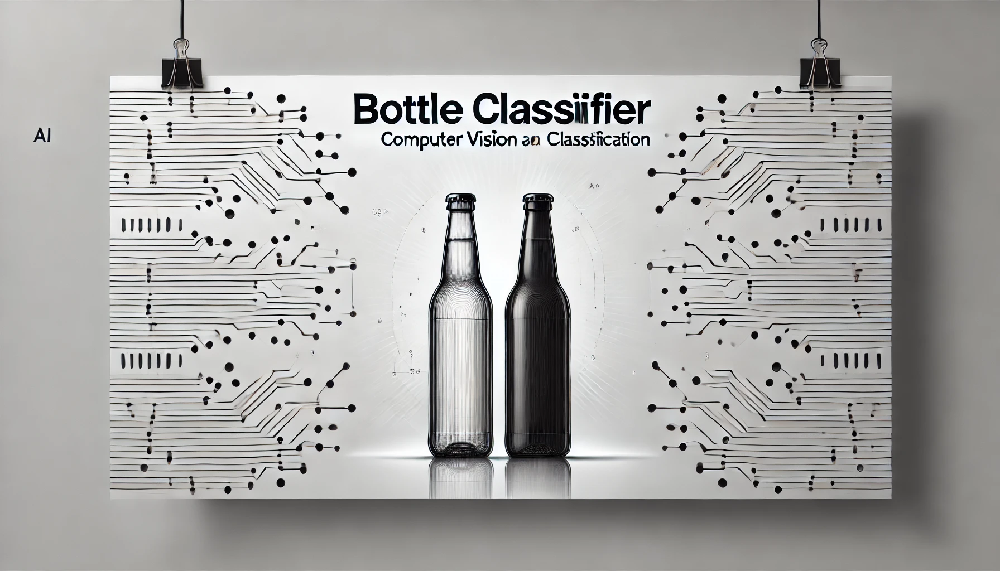
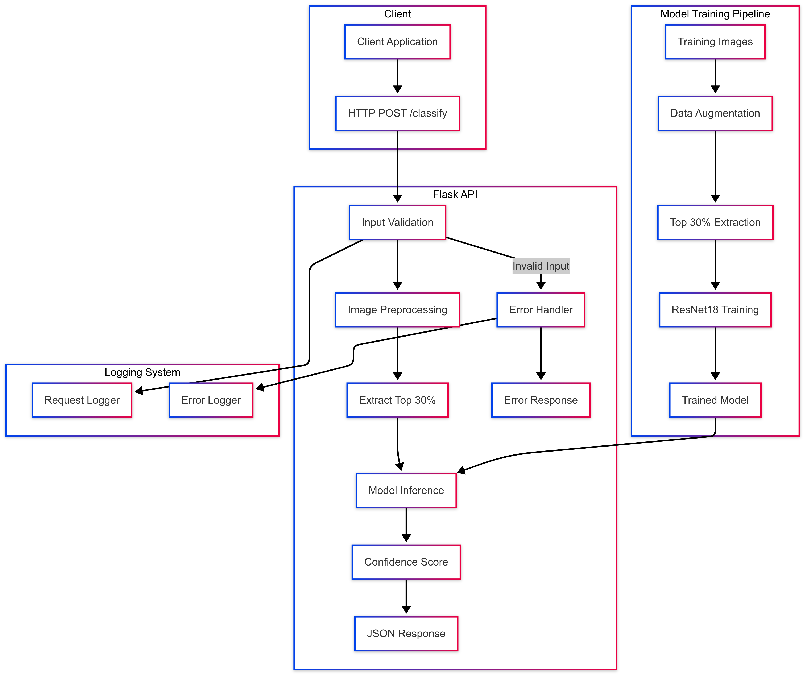
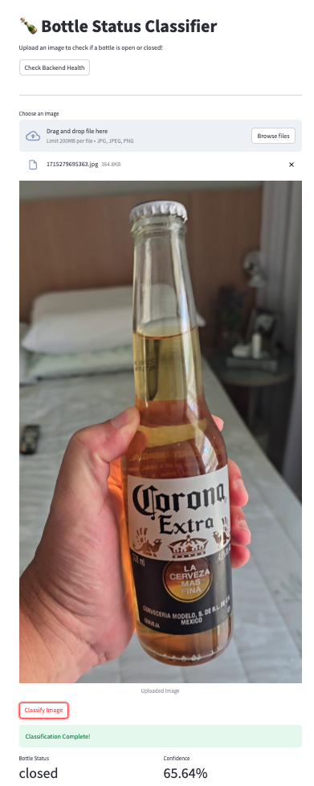
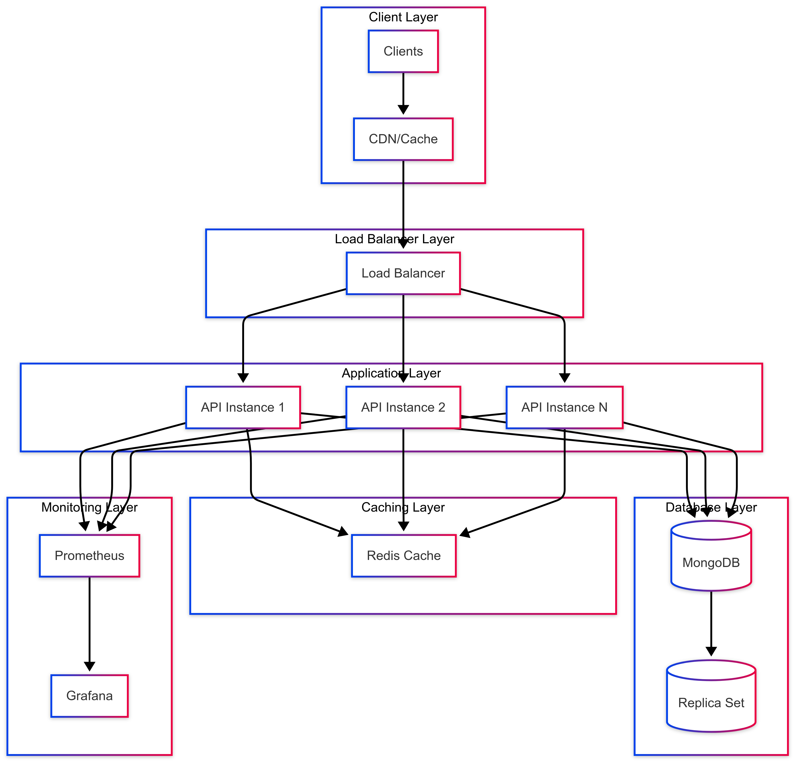

# Bottle Classifier using Pytorch and ResNet




## 📖 Table of Contents
- [Bottle-Classifier-using-PyTorch-and-ResNet](#bottle-classifier-using-pytorch-and-resnet)
  - [📖 Table of Contents](#-table-of-contents)
  - [📌 Overview](#-overview)
  - [💻 Hardware](#-hardware)
  - [📂 Project Structure](#-project-structure)
  - [📊 Dataset](#-dataset)
  - [🖼️ Data Augmentation](#-data-augmentation)
  - [🧠 Model](#-model)
  - [📄 API Documentation](#-api-documentation)
  - [🔧 Dependencies](#-dependencies)
  - [🚀 Usage](#-usage)
  - [📈 Scalability](#-scalability)
  - [📜 License](#-license)
  - [👤 Authors](#-authors)


---

## 📌 Overview

This repository provides an implementation of a **bottle classifier** using the **ResNet-18** model. The goal is to classify whether a bottle is open or closed based on image input.



This project is a **computer vision pipeline** designed to detect whether a bottle is open or closed. It leverages a **Flask**-based API for receiving classification requests and returning inference results. Under the hood, a **ResNet** model is trained on augmented images, specifically focusing on the **top 30%** of each input image to increase detection accuracy.

1. **Client Application**  
   - Sends an HTTP POST request to the `/classify` endpoint with an image.  
   - Receives the classification result indicating if the bottle is open or closed.

2. **Flask API**  
   - **Input Validation**: Ensures the uploaded image is valid before passing it to the model.  
   - **Image Preprocessing**: Performs transformations, including cropping the top 30% region for focused analysis.  
   - **Model Inference**: Invokes the trained ResNet model to generate predictions and calculates a **confidence score**.  
   - **JSON Response**: Returns the classification result along with the associated confidence score.

3. **Model Training Pipeline**  
   - **Data Augmentation**: Expands the dataset with various transformations to improve model robustness.  
   - **Top 30% Extraction**: Focuses on the region of interest where the bottle’s opening typically appears.  
   - **ResNet18 Training**: Builds and fine-tunes a model capable of accurately detecting the bottle’s open/closed state.  
   - **Trained Model**: Deployed within the Flask API for real-time inference.

4. **Logging System**  
   - **Request Logger**: Tracks incoming classification requests.  
   - **Error Logger**: Records issues such as invalid inputs or model failures.

By combining **Flask**, **ResNet**, and thorough **logging**, this system offers a streamlined approach for detecting open or closed bottles at scale.

---

## 💻 Hardware
This is the hardware that was used to train the ResNet18 Model.
###  MacBook Air (2022) 

- **Chip:** Apple M2 (5nm)
- **CPU:** 10-core (8 performance + 2 efficiency cores)
- **GPU:** 10-core Apple GPU (Metal-optimized for ML tasks)
- **Neural Engine:** 16-core (accelerates model inference)
- **Memory:** 24GB unified RAM (high bandwidth, shared across CPU/GPU)
- **Storage:** 256 GB 

---

## 📂 Project Structure

The project is structured into multiple components to ensure modularity, scalability, and maintainability.

```bash
/Users/jorgesandoval/Documents/Code/api-bottle-open-close-detection
├── backend
│   ├── logs
│   └── src
│       ├── app
│       │   ├── models
│       │   ├── routes
│       │   ├── services
│       │   └── utils
├── docs
│   ├── images
│   └── samples
│       ├── closed
│       └── open
├── frontend
│   └── src
├── model
│   ├── checkpoints
│   ├── data
│   │   ├── augmented
│   │   │   ├── test
│   │   │   │   ├── closed
│   │   │   │   └── open
│   │   │   ├── train
│   │   │   │   ├── closed
│   │   │   │   └── open
│   │   │   └── val
│   │   │       ├── closed
│   │   │       └── open
│   │   ├── logs
│   │   ├── processed
│   │   │   ├── closed
│   │   │   └── open
│   │   └── raw
│   │       ├── closed
│   │       └── open
│   ├── logs
│   └── src
├── tests
└── utils
    └── test_images
```
### **Backend**
Contains the core logic of the API, including models, routes, and services:
- `logs/`: Stores backend logs.
- `src/app/`: Houses application-related modules.
  - `models/`: Contains machine learning models.
  - `routes/`: API route definitions.
  - `services/`: Business logic and service implementations.
  - `utils/`: Utility functions for processing.

### **Docs**
Includes documentation and sample images:
- `images/`: Stores reference images.
- `samples/`: Example bottle images categorized into `open` and `closed`.

### **Frontend**
Frontend source code for interacting with the API:
- `src/`: Contains UI components and frontend logic.

### **Model**
Handles the model training and data processing pipeline:
- `checkpoints/`: Stores trained model checkpoints.
- `data/`: Organizes datasets for training, validation, and testing.
  - `raw/`: Original images.
  - `processed/`: Preprocessed images.
  - `augmented/`: Augmented dataset for improved model generalization.
- `logs/`: Logs related to training and evaluation.
- `src/`: Scripts related to model training and evaluation.

### **Tests**
Unit tests and integration tests for validating the API functionality.

### **Utils**

Contains utility scripts and test images for debugging and validation.

---

## 📊 Dataset

The dataset contains 3,640 images of open bottles and 4,949 images of closed bottles. To help you understand the image types suitable for training your own model, ten sample images of each category (open/closed) are available in the `docs/samples` directory.

## 🖼️ Data Augmentation

### 1. Region of Interest (ROI) Extraction
* Algorithm extracts top 30% of bottle images using formula: *height_crop = original_height × 0.3*
* Preserves original width and aspect ratio
* Focuses specifically on the bottle cap region critical for classification

### 2. Augmentation Techniques
* **Geometric Transformations**:
    * Rotation: ±10 degrees with 70% probability
    * Horizontal flipping with 50% probability
* **Intensity Adjustments**:
    * Brightness range: 0.8× to 1.2× of original intensity
    * Contrast modifications: *I_new = α(I_original - μ) + μ*
* **Noise and Blur**:
    * Gaussian noise with variance range [10.0, 50.0]
    * Motion and Gaussian blur with kernel size 3×7
* **Geometric Distortions**:
    * Optical distortion (limit: 0.05)
    * Grid distortion (5-step transformation)

### 3. Dataset Partitioning
* Training Set: 70% (full augmentation)
* Validation Set: 15% (limited augmentation)
* Test Set: 15% (no augmentation)
* Maintains class balance across all splits

### 4. Quality Control
* Format support: JPEG (95% quality) and PNG (level 6 optimization)
* Maximum dimension: 4096 pixels
* Color space: 24-bit RGB
* Integrity verification for all processed images

---

## 🧠 Model
The ResNet-18 (Residual Network with 18 layers) is a deep convolutional neural network that introduces residual connections to ease training. Below is the architectural visualization of ResNet-18:


### Why Use ResNet-18 Instead of Object Detection Models?
For classifying **open vs. closed bottles**, using object detection models such as **YOLO, Detectron, EfficientDet, or RetinaNet** would be inefficient. Here’s why:

1️⃣ **Task Simplicity**
- Object detection models are designed for **locating and classifying multiple objects** in an image, while this task is a simple **binary classification** problem.
- Using a detection model would introduce unnecessary computational overhead.

2️⃣ **Model Complexity & Performance**

| Model         | Purpose                     | Complexity | Suitability for Open/Closed Classification |
|--------------|-----------------------------|------------|--------------------------------------|
| ResNet-18    | Image Classification        | ✅ Lightweight | ✅ Best choice |
| YOLO         | Object Detection            | ❌ Heavy | ❌ Overkill |
| Detectron    | Instance Segmentation       | ❌ Very Heavy | ❌ Unnecessary |
| EfficientDet | Efficient Object Detection  | ❌ Medium | ❌ Not ideal |
| RetinaNet    | High-Accuracy Detection     | ❌ Heavy | ❌ Unnecessary |

- **ResNet-18** is significantly **lighter** than object detection models and provides **sufficient accuracy** for classification.
- Object detection models require **bounding box annotations**, which are unnecessary in this case.

3️⃣ **Training & Inference Speed**
- Object detection models require **more computational power**.
- **ResNet-18** is optimized for **fast training and inference** on CPU/GPU, making it ideal for deployment.

4️⃣ **Data Requirements**
- Object detection models require **annotated bounding boxes**, increasing labeling effort.
- ResNet-18 only needs **labeled images**, simplifying dataset preparation.

5️⃣ **Interpretability & Fine-tuning**
- ResNet-18 is easier to interpret and **fine-tune on new datasets**.
- Object detection models involve complex region proposals, making fine-tuning harder.

### How to Train Your Dragon (Ops... Model)

1. **Environment Setup**
   * Create Python 3.11 environment: `conda create -n bottle_classifier python=3.11`
   * Activate environment: `conda activate bottle_classifier`
   * Install requirements: `pip install -r model/requirements.txt`

2. **Prepare Your Data**
   * Create directory structure:
     ```
     model/data/raw/
     ├── open/      # Open bottle images
     └── closed/    # Closed bottle images
     ```
   * Add at least 100 images per class (JPG, JPEG, PNG formats)

3. **Run Data Augmentation**
   * Navigate to source: `cd model/src`
   * Execute: `python augment.py`
   * Verify generated folders in `model/data/augmented/`

4. **Train the Model**
   * Execute: `python train.py`
   * Monitor progress in console
   * Find best model at `model/checkpoints/best_model.pth`

5. **Troubleshooting**
   * No GPU: Model automatically uses CPU
   * Memory issues: Reduce batch size in `config.yaml`
   * Module errors: Verify environment activation
   * Poor results: Ensure sufficient, diverse training data

Monitor `model/logs/training.log` for progress. After completion, your trained model will be ready for use in the backend service.

## 📄 API Documentation

### 1. Health Check Endpoint
```http
GET /health
```
Checks if the API service is running properly.

#### Response
```json
{
    "status": "healthy",
    "service": "bottle-classifier-api"
}
```

### 2. Classify Bottle Endpoint
```http
POST /classify
```
Analyzes an uploaded image and determines if the bottle is open or closed.

#### Request
- **Method**: POST
- **Content-Type**: multipart/form-data
- **Body Parameter**:
  - `image`: Image file (Required)
    - Supported formats: JPG, JPEG, PNG
    - Maximum file size: 16MB
    - Maximum dimensions: 4096x4096 pixels

#### Success Response
- **Code**: 200 OK
- **Content Example**:
```json
{
    "Bottle_Status": "open",
    "Confidence": 0.85
}
```

- **Fields**:
  - `Bottle_Status`: String - Either "open" or "closed"
  - `Confidence`: Float - Confidence score between 0 and 1

#### Error Responses

##### No Image Provided
- **Code**: 400 Bad Request
```json
{
    "error": "No image file provided"
}
```

##### Invalid Image Format
- **Code**: 400 Bad Request
```json
{
    "error": "Invalid image format. Allowed formats: jpg, jpeg, png"
}
```

##### Image Too Large
- **Code**: 400 Bad Request
```json
{
    "error": "File size exceeds maximum limit"
}
```

##### Server Error
- **Code**: 500 Internal Server Error
```json
{
    "error": "Internal server error"
}
```

###  3. Usage Examples

#### cURL
```bash
curl -X POST \
  -F "image=@/path/to/your/bottle.jpg" \
  https://bottle-classifier-backend.onrender.com/classify
```

#### Python
```python
import requests

# Classify an image
image_path = 'path/to/your/bottle.jpg'
with open(image_path, 'rb') as f:
    files = {'image': f}
    response = requests.post('https://bottle-classifier-backend.onrender.com/classify', files=files)

print(response.json())
```

### 4. Rate Limiting and Usage
- Free tier limitations apply
- Service may have cold starts after 15 minutes of inactivity
- First request might take longer due to service warm-up

### 5. Error Handling
The API implements robust error handling:
- Validates image format and size before processing
- Provides clear error messages for common issues
- Logs errors for debugging purposes

### 6. Status Codes
- 200: Successful request
- 400: Bad request (invalid input)
- 500: Server error

## 🔧 Dependencies

To run this project, you'll need the following libraries:

### Web Framework
- flask>=2.3.3
- flask-cors>=4.0.0
- Werkzeug>=2.3.7
- python-dotenv>=1.0.0
- gunicorn>=21.2.0

### Deep CNN Model
- torch>=2.1.0
- torchvision>=0.16.0
- numpy>=1.24.3
- Pillow>=10.0.0

### Utilities
- PyYAML>=6.0.1
- python-json-logger>=2.0.7
- tqdm>=4.65.0

### Development and Testing
- pytest>=7.4.0
- black>=23.7.0
- flake8>=6.1.0

### FrontEnd
- streamlit>=1.24.0
- requests>=2.31.0
- pillow>=9.5.0,<10.0.0 
- python-dotenv>=1.0.0

You can install these using `pip`:

```bash
pip install -r ./backend/requirements.txt
pip install -r ./backend/frontend.txt
```

## 🚀 Usage

1. **Clone the repository:**

   ```bash
   git clone https://github.com/jorgesandoval/api-bottle-open-close-detection.git
   ```
2. **Navigate to the main directory"**

    ```bash
    cd api-bottle-open-close-detection
    ```
3. **Run the deploy script**
    ```bash
    sh utils/deploy.sh
    ```
4. **Using the Streamlit interface**
 - Access htpp://0.0.0.0:8501
 - Choose an image
 - Click in "Classify Image"



4. **Testing it using `pytest`**
- Run all tests
    ```bash
    pip install pytest
    ```
- Run specific test file
    ```bash
    pytest tests/test_api.py
    pytest tests/test_model.py
    ```
- Run with verbose output
    ```bash
    pytest -v
    ```
- Run and show print statements
    ```bash
    pytest -s
    ```
5. **Test scalability using `locust`**
    ```bash
   pip install -r utils/requirements.loadtest.txt
   locust -f load_test.py --host=http://0.0.0.0:5000")
    ```

## 📈 Scalability

### Infrastructure and Scalability Requirements

The system architecture has been designed to ensure a **scalable, reliable, and efficient** bottle classification API that can handle high traffic loads while maintaining performance and availability. Below is a detailed breakdown of the architecture and its various components.

The **Client Layer** consists of users accessing the API via web or mobile applications. To optimize performance, a **Content Delivery Network (CDN) and caching mechanisms** are employed, which help reduce latency and minimize redundant requests to the backend servers.

Requests are routed through a **Load Balancer**, which ensures even distribution of traffic across multiple API instances in the **Application Layer**. The load balancer is configured with **least connections routing** and conducts **health checks every 30 seconds** to maintain service reliability. SSL termination at this layer also enhances security and improves performance by offloading encryption processes from API instances.

The **Application Layer** hosts multiple instances of the bottle classification API, each independently processing requests using the **ResNet-18 model** in PyTorch. This layer supports **auto-scaling** based on CPU, memory usage, and request queue length, allowing the system to dynamically scale up or down based on demand.

To optimize response time and minimize redundant computations, the **Caching Layer** is implemented using **Redis**. The cache stores recently classified results so that similar requests can be quickly retrieved without reprocessing.

The **Database Layer** is responsible for storing classification logs, image metadata, and model performance metrics. **MongoDB** is used as the primary database due to its scalability and ability to handle unstructured image metadata. The database is designed with a **3-node replica set** for high availability and fault tolerance. Additionally, **sharding is employed** to distribute data efficiently and ensure consistent query performance.

For **Monitoring and Metrics**, **Prometheus** is used to collect real-time system metrics such as request count, response time, and error rate. **Grafana** visualizes these metrics, providing insights into system performance and allowing for proactive issue resolution.

Security is a key consideration in this architecture. API authentication is enforced using **HMAC-based API key management**, with **rate limits** applied per user tier (Bronze, Silver, Gold) to prevent abuse. Network security measures include **TLS 1.3 encryption**, **firewall rules**, and **geo-restrictions** to enhance system protection.

The choice of **MongoDB** for logging ensures that large amounts of classification metadata can be handled efficiently, enabling quick retrieval and scalability. The **Redis caching layer** improves response times by storing frequently requested results in memory. The system adopts a **horizontal scaling strategy** to accommodate growing demand, allowing additional API instances to be added dynamically, ensuring uninterrupted service. Furthermore, regional deployment reduces latency by placing API instances closer to users, and automatic failover ensures resilience in the event of system failures.





#### 2. Database Design
- **Database Type:** **MongoDB (NoSQL)** to handle unstructured image metadata and classification logs.
- **Schema Design:**
```json
{
  "request_logs": {
    "timestamp": "ISODate",
    "client_id": "String",
    "image_metadata": {
      "size": "Number",
      "format": "String",
      "dimensions": "Array"
    },
    "classification": {
      "result": "String",
      "confidence": "Number"
    },
    "performance": {
      "processing_time": "Number",
      "model_version": "String"
    }
  }
}
```
- **Sharding Strategy:** Uses **composite shard keys (client_id, timestamp)** for scalability.
- **Replication:** **3-node replica set** for high availability and fault tolerance.

## 📜 License

Distributed under the MIT License. See [LICENSE](https://opensource.org/licenses/MIT) for more information.

## 👤 Authors
* [Jorge Sandoval](https://www.linkedin.com/in/jorge-g-sandoval/)

